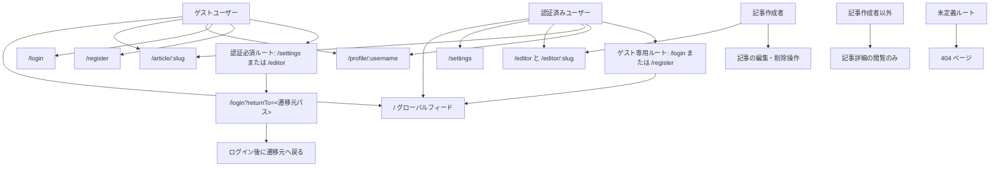

# Frontend Features

> Issue: #36
> Status: 初版

この文書は React + TypeScript + Vite で Blog Service MVP を実装するための画面、ルーティング、feature 分割、フォーム、エラーハンドリング方針を定義する。

## Current State

- `frontend/` は Vite starter から開始している。
- React Router はまだ依存関係に含まれていない。
- 実装 Issue では React Router 導入、starter 画面の置き換え、`app/`, `features/`, `shared/`, `lib/` 構成への移行を行う。

## Route Plan

| Screen | Path | Auth | Primary feature | Purpose |
| --- | --- | --- | --- | --- |
| Home | `/` | Optional | `article`, `feed`, `tag` | Global Feed / Your Feed / Popular Tags |
| Login | `/login` | Guest | `auth` | Existing User login |
| Register | `/register` | Guest | `auth` | New User registration |
| Settings | `/settings` | Required | `auth`, `profile` | Current User settings update |
| New Editor | `/editor` | Required | `article`, `tag` | Create Article |
| Edit Editor | `/editor/:slug` | Required | `article`, `tag` | Update own Article |
| Article Detail | `/article/:slug` | Optional | `article`, `comment`, `favorite` | Article body, comments, favorite |
| Profile | `/profile/:username` | Optional | `profile`, `article`, `follow` | Author profile and authored Articles |
| Profile Favorites | `/profile/:username/favorites` | Optional | `profile`, `article`, `favorite` | Articles favorited by Profile User |

認証区分:

- Guest: 認証済みユーザーは login/register から別画面へ遷移させる。
- Required: 未認証ユーザーは return path 付きで `/login` へ遷移させる。
- Optional: ゲストでも表示し、有効な BFF BrowserSession がある場合だけ `following` / `favorited` の判定に使う。

## 画面遷移図

Issue #63 の App Shell では、React Router の route guard を次の遷移で扱う。



## App Structure

```text
frontend/src/
├── app/
│   ├── providers/
│   │   ├── AuthProvider.tsx
│   │   └── AppProviders.tsx
│   └── routes/
│       ├── router.tsx
│       ├── HomePage.tsx
│       ├── LoginPage.tsx
│       ├── RegisterPage.tsx
│       ├── SettingsPage.tsx
│       ├── EditorPage.tsx
│       ├── ArticleDetailPage.tsx
│       └── ProfilePage.tsx
├── features/
│   ├── auth/
│   ├── article/
│   ├── comment/
│   ├── favorite/
│   ├── feed/
│   ├── profile/
│   └── tag/
├── shared/
│   ├── components/
│   ├── hooks/
│   ├── types/
│   └── utils/
└── lib/
    ├── apiClient.ts
    ├── bffSession.ts
    ├── csrf.ts
    └── apiError.ts
```

Pages in `app/routes/` compose feature components only. They do not own API calls, validation schemas, or domain-specific state.

## Feature Responsibilities

| Feature | Responsibility | Owns | Does not own |
| --- | --- | --- | --- |
| `auth` | Login, register, current User, settings update | BFF session API, auth forms, session lifecycle hooks | Profile following, Article list |
| `article` | Article list, detail, create, update, delete | Article API, editor form, article cards | Favorite mutation internals |
| `comment` | List, create, delete comments | Comment API, comment form/list | Article ownership calculation |
| `profile` | Profile display and profile tabs | Profile API, follow button composition | Auth credential management |
| `favorite` | Favorite / unfavorite actions | Favorite API, favorite button state | Article fetching |
| `feed` | Your Feed and Global Feed switching | Feed API, feed tabs | Article card rendering internals |
| `tag` | Popular tags and tag filtering | Tag API, tag selector/list | Article list pagination |

Each feature exposes only a small barrel API from `features/<feature>/index.ts`.
Cross-feature imports must go through those public exports, and direct imports into another feature's internal directories are prohibited.

## Screen Composition

### Home

Primary workflow:

- Show Global Feed for guests and authenticated users.
- Show Your Feed tab only when authenticated.
- Show selected tag tab when a tag filter is active.
- Show Popular Tags side area.
- Paginate articles with `limit` and `offset`.

Components:

| Component | Owner | Responsibility |
| --- | --- | --- |
| `HomePage` | `app/routes` | Layout and tab composition |
| `ArticleList` | `article` | Article summary list and pagination |
| `FeedTabs` | `feed` | Global / Your Feed / Tag tab state |
| `PopularTags` | `tag` | Tag list and tag filter selection |

### Login / Register

Primary workflow:

- Validate input for immediate UI feedback.
- Request a CSRF proof from the same-origin BFF before a mutating auth request.
- Submit to the BFF session API.
- Let the BFF establish an `HttpOnly` BrowserSession cookie; JavaScript does not receive an auth token.
- Refresh current User state.
- Redirect to return path or Home.

Components:

| Component | Owner | Responsibility |
| --- | --- | --- |
| `LoginPage` / `RegisterPage` | `app/routes` | Route layout |
| `LoginForm` / `RegisterForm` | `auth` | Form state, submit state, field errors |
| `FormErrorList` | `shared` | RealWorld errors display |

### Settings

Primary workflow:

- Load current User.
- Update email, username, password, bio, image through `PUT /api/session/user` on the BFF.
- Reflect validation errors.
- Logout invalidates the BrowserSession and its server-side JWT through the BFF and redirects Home.

### Editor

Primary workflow:

- `/editor` creates a new Article.
- `/editor/:slug` loads and updates an existing Article.
- After success, navigate to `/article/:slug`.
- If the current User is not the Author, show a forbidden state and prevent update.

### Article Detail

Primary workflow:

- Load Article by slug.
- Show full body, tagList, author profile summary, favorite button.
- Show comments for guests and authenticated users.
- Show comment form only when authenticated.
- Allow Comment deletion only for the Comment author.
- Allow Article edit/delete only for the Article author.

### Profile / Profile Favorites

Primary workflow:

- Load Profile by username.
- Show follow button when viewing another User and authenticated.
- Show authored Articles on `/profile/:username`.
- Show favorited Articles on `/profile/:username/favorites`.

## Form Requirements

| Form | Fields | Success | Main errors |
| --- | --- | --- | --- |
| Login | email, password | browser session established, redirect | invalid credentials, validation |
| Register | username, email, password | browser session established, redirect | duplicate username/email, validation |
| Settings | image, username, bio, email, password | current User updated | duplicate username/email, validation |
| Article Editor | title, description, body, tagList | navigate to Article Detail | validation, forbidden on edit |
| Comment | body | append or refetch comments | unauthenticated, validation |

Frontend validation is for UI feedback only. Backend FormRequest validation remains the source of truth.

Form behavior:

- Disable submit button while submitting.
- Prevent double submit.
- Show field-level errors below fields.
- Show API-level RealWorld `errors.body` messages above the form.
- Preserve user input after validation failure.

## Error Handling

| Error | Handling |
| --- | --- |
| `401 Unauthorized` | Clear current User state and redirect to `/login` for required routes |
| `403 Forbidden` | Show permission error state and hide forbidden commands |
| `404 Not Found` | Render not found page for Article/Profile routes |
| `419 CSRF Token Mismatch` | BFF から CSRF proof を再取得し、ユーザー操作を再実行できる状態にする |
| `422 Unprocessable Entity` | Map API validation errors to form/global errors |
| Network failure | Show retryable error state |
| Unexpected error | App-level Error Boundary with generic message |

`lib/apiClient.ts` should normalize API errors into typed errors so feature hooks do not parse raw `Response` objects.

## State Management

| State | Owner | Approach |
| --- | --- | --- |
| Browser session | BFF + `HttpOnly` cookie | Frontend JavaScript does not read or retain credentials |
| Current User | `app/providers/AuthProvider` | context + refresh action |
| Form input | feature form component | local state or form hook |
| Server data | feature hooks | query hooks; cache library can be introduced in a dedicated implementation Issue |
| UI toggles | local component | local state |

Server state must not be copied into broad global UI state.

## API Layer

Feature API functions live under `features/<feature>/api/`.
They call only the same-origin BFF and convert its browser-facing response fields into frontend camelCase types where appropriate. The Browser does not call the Public API origin directly.

Example responsibilities:

- `features/auth/api/login.ts`
- `features/article/api/listArticles.ts`
- `features/comment/api/createComment.ts`
- `features/profile/api/getProfile.ts`
- `features/favorite/api/favoriteArticle.ts`
- `features/feed/api/getFeed.ts`
- `features/tag/api/getTags.ts`

Shared HTTP concerns live in `lib/`:

- base URL
- same-origin BFF requests with browser credentials
- CSRF bootstrap before login/register and other mutating requests
- CSRF header handling for mutating requests
- response parsing
- API error normalization

## Test Strategy

Frontend tests should use Vitest + Testing Library and assert user-visible behavior.

Initial implementation Issue candidates:

1. App shell and React Router setup
2. API client and error normalization
3. Auth provider and auth forms
4. Article list/detail/editor flows
5. Comment list/create/delete flows
6. Profile/follow/favorites flows
7. Feed and tag filtering flows
8. Route guards and error pages

Test examples:

- Login form disables submit while pending and shows validation errors.
- Required route redirects guest users to Login.
- Home renders Global Feed and Popular Tags.
- Article Detail hides comment form for guests.
- Editor prevents non-author update UI.
- 422 API errors are shown without clearing input.

## Security Notes

- Do not store secrets or API keys in frontend source.
- Do not use `innerHTML` or `dangerouslySetInnerHTML` for Article body in MVP.
- Do not store JWT, session identifiers, or refresh tokens in `localStorage`, `sessionStorage`, or React state.
- Browser authentication uses BFF-managed `HttpOnly` session cookies; `lib/` sends same-origin credentialed requests and CSRF proof without reading the auth cookie.
- The default API client uses relative `/api/*` so the browser reaches the same-origin BFF through the frontend dev proxy.
- `VITE_API_BASE_URL` must not target the Public API origin such as `http://localhost:8080`; if a local `.env.local` still has that value, remove it and use `BFF_PROXY_TARGET` to configure the Vite proxy target instead.
- Backend authorization remains required even when frontend hides buttons.
